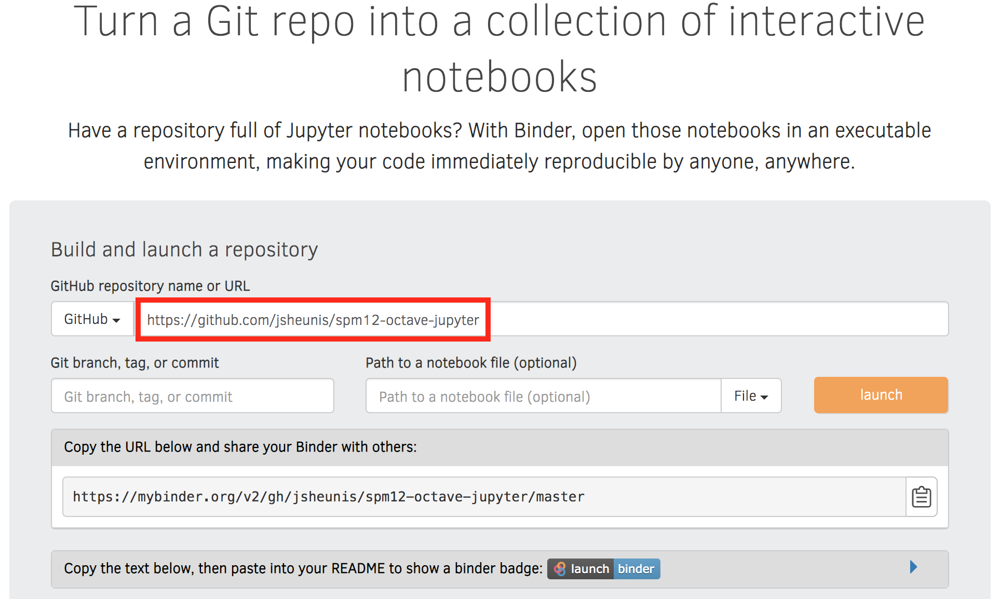
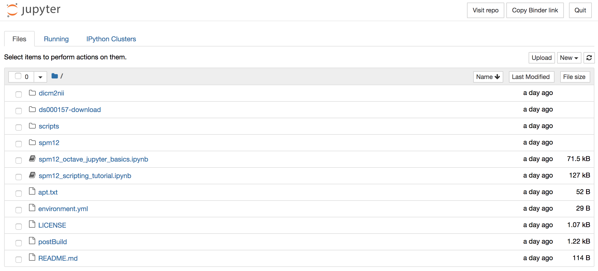

I previously shared a post about setting up a reproducible environment for [fMRI analysis with Code Ocean](https://jsheunis.github.io/2018-10-31-reproducible-fmri-codeocean/).
In this post I'll cover how you can do the same with a framework of free and open source services, which rests mainly on [Binder](https://mybinder.org/).

If you don't want to do all of the background reading, here are the TLDR links:
- [Github repository]()
- [Reproducible environment on Binder]()
- [Step-by-step on how to set it all up]()

## Reproducible environments

Since starting [my journey with Python](https://twitter.com/fmrwhy/status/1106681592834076672?s=20) and the wider ecosystem of open source tools and practices in neuroimaging,
I've been using Jupyter notebooks and Binder regularly. And it's great!
It's such an easy way (after the initial setup) to allow others to run your exact analysis on the same data using the exact same code and software/library versions.
With the traditional idea of a journal articles and the accompanying archaic publishing system needing a complete overhaul (viva la revolución \\:D/),
the combination of Jupyter and Binder gets us a long way towards sharing open, reproducible and future-aware scientific content.
I love how this illustration by [Juliette Taka](https://twitter.com/JulietteTaka) captures the core of what I'm trying to get at:


*The process of generating reproducible research output. Source: http://juliettetaka.com/*

Another great aspect is the fact that it's free (*gratis*): you can use most of these Python-related resources without paying a license fee.
As die-hard open so(u)rcerers (yes, that expression exists now) will point out, this is not the case for Matlab.
And neither, one might think, for Matlab libraries.
However, with the combination of Matlab libraries (like [SPM12](https://www.fil.ion.ucl.ac.uk/spm/software/download/)),
an [Octave kernel](https://github.com/Calysto/octave_kernel), [Jupyter notebooks](https://jupyter.org/) and [Binder](https://mybinder.org/),
this is indeed possible. You can share a fully reproducible environment with Matlab-turned-Octave code for free.

In this post I will run through the basics of setting up this framework to run reproducible, single-subject fMRI analysis using [SPM12](https://www.fil.ion.ucl.ac.uk/spm/software/download/).
I'll start with short overviews of the main components, highlighting their specific roles in the overall framework.
Then I'll explain how to put them together until you have a fully reproducible environment in the cloud. 

## Jupyter

From their website, Project Jupyter

> exists to develop open-source software, open-standards, and services for interactive computing across dozens of programming languages

The [Jupyter notebook](https://jupyter-notebook.readthedocs.io/en/stable/) has become almost ubiquitous in some (probably mostly computation- and Python-heavy) scientific sub-fields.
It allows the interactive development and rendering of formatted text (using Markdown), equations, code (with support for multiple languages), script outputs, user inputs, interactive widgets, and more - all in a single browser-based document.
It is just... \* *chef's kiss* \*

To [install Jupyter notebook](https://jupyter.readthedocs.io/en/latest/install.html#install) on your workstation, you will need a locally installed and compatible Python version.
Installation instructions will vary based on your experience and local operating system.
Common advice is to install [Anaconda Distribution](https://www.anaconda.com/distribution/), which contains Python, Jupyter notebook, and many other packages. 

I have a Mac and use `conda` (via [miniconda3](https://docs.conda.io/en/latest/miniconda.html)) for virtual environment management.
I create a new `conda` environment for each new project, and then I use `pip` inside the environment to install the required packages.
I don't know if this is recommended or warned against by the wizards, but it works well for my workflow.
With such a setup, this is how I would typically create a Jupyter notebook:

```bash
# Create a new python environment named `spm12-octave-jupyter`
conda create -n spm12-octave-jupyter python
# When the environment has been created, activate it
conda activate spm12-octave-jupyter
# Inside the environment, use pip to install jupyter
pip install jupyter
# After installaiton, run jupyter notebook
jupyter notebook
# this opens a new tab in your browser with the jupyter notebook
```

Now you can write fancy equations and run python code in a local Jupyter notebook. Yay!

Now, say you want to run *Matlab* code, e.g. fMRI analysis scripts using SPM12, instead of *Python* code in your Jupyter notebook, is this still possible?
Indeed, using Octave and an Octave kernel for Jupyter, it is possible.

## Octave

[GNU Octave](https://www.gnu.org/software/octave/) is a high-level, open source programming language that is mostly compatible with Matlab.
Matlab scripts and functions often have drop-in compatibility with Octave, meaning you can typically (with exceptions) run your Matlab-developed code in an Octave environment.

To run a local Octave-based Jupyter notebook, you will have to [install GNU Octave](https://www.gnu.org/software/octave/#install) first.
After this, you will need to install [this Octave kernel](https://github.com/Calysto/octave_kernel) in your Python environment (the same one in which Jupyter is installed).
According to their instructions, either `pip` or `conda` can be used to install this kernel.


## SPM12

[SPM12](https://www.fil.ion.ucl.ac.uk/spm/software/spm12/) is a free and open source software package used in the statistical analysis of brain imaging data.
The [SPM12 Wiki](https://en.wikibooks.org/wiki/SPM/MATLAB) states that:
 
> Whilst the majority of the code is implemented as standard MATLAB M-files, SPM also uses external MEX files, written in C, to perform some of the more computationally intensive operations. Pre-compiled binaries of these external C-MEX routines are provided for several platforms and correspond to files with extensions .mexwin32, .mexwin64, .mexglx, .mexa64, .mexmac, .mexmaci, .mexmaci64, .mexsol, .mexs64.

This is important to mention, since the correct MEX files have to be compiled when using SPM12 with Octave. 

To run SPM12 locally, [download and installation instructions](https://en.wikibooks.org/wiki/SPM/Download) should be followed,
after which the following completes the setup for use with Octave (see [detailed instructions here](https://en.wikibooks.org/wiki/SPM/Octave)):

```bash
cd /spm12/src
make PLATFORM=octave
make PLATFORM=octave install
```

I've written many SPM12 and Matlab based scripts and functions to preprocess and analyse functional neuroimaging data,
and have been looking for a way to share this in a reproducible format (apart from static code shared via GitHub). I've [shared some tutorials before](https://jsheunis.github.io/2018-06-28-spm12-matlab-scripting-tutorial-1/),
but it would be so much better to allow readers to interact with the code as they read through the tutorial.
This lead me to the setup that I'm currently describing.

## Binder

In short, Binder does all of the above for you. You don't have to install anything locally,
you don't have to struggle to find compatible package versions, and you don't have to turn your computer off and on again.

From their [website](https://mybinder.org/), Binder:

> Turn[s] a Git repo into a collection of interactive notebooks. 
Have a repository full of Jupyter notebooks? With Binder, open those notebooks in an executable environment, making your code immediately reproducible by anyone, anywhere.

The core of how Binder works is explained well with this awesome illustration:

*How does Binder work? Image created by [Scriberia](http://www.scriberia.co.uk/) for [The Turing Way](https://github.com/alan-turing-institute/the-turing-way) community and used under a CC-BY licence. [Zenodo record](https://zenodo.org/record/3332808#.Xp4XGNMzbR0).*

Main steps include:
1. Grab content from a specified public code repository (e.g. via GitHub, GitLab, Bitbucket). This may include data, scripts, Jupyter notebooks, and Binder configuration files.
2. Automatically build a [Docker](https://www.docker.com/) image of the repository using [`repo2docker`](https://repo2docker.readthedocs.io/en/latest/).
3. Serve the reproducible computational environment (i.e. the Docker image) through the cloud.

A much more accurate account of the above is provided in the [Binder documentation](https://mybinder.readthedocs.io/en/latest/index.html).
Other useful resources include:
- The [From Zero to Binder!](https://github.com/alan-turing-institute/the-turing-way/blob/master/workshops/boost-research-reproducibility-binder/workshop-presentations/zero-to-binder.md) tutorial by Sarah Gibson at The Alan Turing Institute.
- A long list of [sample Binder-ready Github repositories](https://mybinder.readthedocs.io/en/latest/sample_repos.html), including [one for Octave](https://github.com/binder-examples/octave).
- A [list of configuration files](https://mybinder.readthedocs.io/en/latest/config_files.html) that are useful when making your repository Binder-ready.


## Setting it all up

Here it is, Your Moment of Zen: [https://github.com/jsheunis/spm12-octave-jupyter](https://github.com/jsheunis/spm12-octave-jupyter).

This repository contains what I would say is a minimum necessary setup for a reproducible SPM12, Octave and Jupyter environment.
It is not perfect, it might contain bugs or inefficiencies, and it still needs improvements.
But you can run code that I created, in a reproducible environment, in the cloud, without any effort.

I was inspired to set up this repository in part by the one Guillaume Flandin at UCL [created for SPM12](https://github.com/spm/spm-notebooks),
which was probably inspired by the [repository example from Binder](https://github.com/binder-examples/octave),
for which the notebook was in turn based on that from the [Octave kernel repository](https://github.com/Calysto/octave_kernel/blob/master/octave_kernel.ipynb). Open science in action...

Step by step, this is how to do it:

### 1 - Create a public GitHub repository.

It should be public so that Binder can discover it. You can include `README` and `LICENSE` files for good measure.

### 2 - Include configuration file `environment.yml`

[This file](https://github.com/jsheunis/spm12-octave-jupyter/blob/master/environment.yml) contains the following:

```yaml
dependencies:
- octave_kernel
``` 
which is how the `octave_kernel` Python package is installed, via `conda-forge`. 

### 3 - Include configuration file `apt.txt`

[This file](https://github.com/jsheunis/spm12-octave-jupyter/blob/master/environment.yml) contains the following:

```text
curl
octave
liboctave-dev
gnuplot
ghostscript
awscli
``` 
This is a list of [Debian](https://www.debian.org/) packages that will be installed with `apt-get`.
We specifically need this in order to install GNU Octave.
We also install Octave-related packages that support its use in a Jupyter notebook,
as well as `curl` to download processing scripts and `awscli` to download fMRIn data from [OpenNeuro](https://openneuro.org/).

It is technically also an option to include `octave` as a line in the `environment.yml` file, which would install it via `conda-forge`.
However, you have to take into account which Octave versions are distributed via the different package distribution systems.
Currently, the `apt.txt` route installs `octave 4.2.2`, while `conda-forge` [only has `4.2.1` available](https://anaconda.org/conda-forge/octave). See [this issue](https://github.com/binder-examples/octave/issues/1) for more information.


### 4 - Include configuration file `postBuild`

[This file](https://github.com/jsheunis/spm12-octave-jupyter/blob/master/postBuild) contains code that runs after the desired environment has been created:

````bash
mkdir ${HOME}/scripts && curl -SL https://github.com/jsheunis/matlab-spm-scripts-jsh/archive/v0.1.tar.gz | tar -xzC ${HOME}/scripts --strip-components 1
mkdir ${HOME}/dicm2nii && curl -SL https://github.com/jsheunis/dicm2nii/archive/v0.2.tar.gz | tar -xzC ${HOME}/dicm2nii --strip-components 1
mkdir ${HOME}/spm12 && curl -SL https://github.com/spm/spm12/archive/r7771.tar.gz | tar -xzC ${HOME}/spm12 --strip-components 1
curl -SL https://raw.githubusercontent.com/spm/spm-docker/master/octave/spm12_r7771.patch | patch -d ${HOME}/spm12 -p3

cd ${HOME}/spm12/src
make PLATFORM=octave
make PLATFORM=octave install

cd ${HOME}/spm12/@file_array/private
find . -name "mat2file*.*" -print0 | xargs -0 -I{} find '{}' \! -name "*.mex" -delete
find . -name "file2mat*.*" -print0 | xargs -0 -I{} find '{}' \! -name "*.mex" -delete

cd ${HOME}
octave --no-gui --eval "addpath (fullfile (getenv (\"HOME\"), \"scripts\")); savepath ();"
octave --no-gui --eval "addpath (fullfile (getenv (\"HOME\"), \"dicm2nii\")); savepath ();"
octave --no-gui --eval "addpath (fullfile (getenv (\"HOME\"), \"spm12\")); savepath ();"

aws s3 sync --no-sign-request s3://openneuro.org/ds000157 ds000157-download/ --exclude "*" --include "sub-01/*"
````
This code does the following:
- Download (using `curl`), extract and install (in names directories) the following GitHub repositories:
  - Some of my Matlab and SPM12-based scripts from [this repo](https://github.com/jsheunis/matlab-spm-scripts-jsh)
  - [dicm2nii](https://github.com/xiangruili/dicm2nii), which is great for reading, writing and visualising NIfTI files. I used the code from [my fork](https://github.com/jsheunis/dicm2nii), since I updated some files.
  - [SPM12](https://github.com/spm/spm12/archive/r7771) for reasons which are probably obvious by now. A [patch](https://github.com/spm/spm-docker/blob/master/octave/spm12_r7771.patch) related to Octave is also installed.
- Compile the MEX files for Octave
- In the SPM12 directory, find and delete all `mat2file*.*` files except for `mat2file.mex` (and do the same for `file2mat*.*` files). This is needed due to a bug in Octave something something MEX files something something private directories.
For more information on the "something something", dear reader, please have a look at [this issue](https://github.com/spm/spm-notebooks/issues/1).
This is also related to the Octave version issue mentioned previously, since having a more recent version of Octave available would negate the need for the current workaround.
- Add the directories containing the downloaded code to the Octave path.
- Use `awscli` to download a single subject's fMRI data from [OpenNeuro/ds000157](https://openneuro.org/datasets/ds000157/versions/00001).

### 5 - Include Jupyter notebooks (`*.ipynb` files)

This is where our reproducible fMRI analysis will actually be done. In line with not having to do any actual development or installations on your own system,
you can actually just include an empty `.ipynb` file in the repository and then do the development once your Binder environment is live.
You can then download the updated notebook from your browser and just replace the original empty one with the updated one.

### 6 - Push your changes!

```bash
git add --all
git commit -m "my first binder-ready repository!"
git push origin master
```

### 7 - Hand the reins over to Binder

The code repository is now Binder-ready.
All that is left to do is to point Binder to the repository:
- Go to [https://mybinder.org/](https://mybinder.org/)
- Copy your repository URL (e.g. "https://github.com/jsheunis/spm12-octave-jupyter") into the input field (shown below)
- Press the "Launch" button
- You can also copy the code for the "Launch Binder" badge to add to your README file.


*A snapshot from mybinder.org.*

The launch process might take several minutes depending on your requirements and whether a pre-built image is already available (I've waited up to 15min before, but it's mostly shorter).

Upon successful launch, you should see the following directory/file browser setup, from where you can explore the installed libraries and the Jupyter notebooks:



Currently, the notebooks include:
- `spm12_octave_jupyter_basics.ipynb` - which runs through some basic commands and functonalities
- `spm12_scripting_tutorial.ipynb` - which is step by step SPM12 scripting tutorial based on my [original post](https://jsheunis.github.io/2018-06-28-spm12-matlab-scripting-tutorial-3/) and which achieves essentially the same as the Code Ocean compute capsule [described here](https://jsheunis.github.io/2018-10-31-reproducible-fmri-codeocean/).  


## Notes and disclaimers