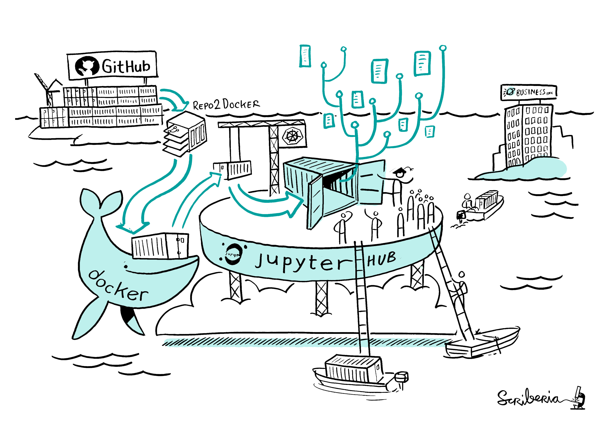

I previously shared a post about setting up a reproducible environment for [fMRI analysis with Code Ocean](https://jsheunis.github.io/2018-10-31-reproducible-fmri-codeocean/).
In this post I'll cover how you can do the same with a framework of free and open source services, which rests mainly on [Binder](https://mybinder.org/).

If you don't want to do all of the background reading, here are the TLDR links:
- [Github repository]()
- [Reproducible environment on Binder]()
- [Step-by-step on how to set it all up]()

## Reproducible environments

Since starting [my journey with Python](https://twitter.com/fmrwhy/status/1106681592834076672?s=20) and the wider ecosystem of open source tools and practices in neuroimaging,
I've been using Jupyter notebooks and Binder regularly. And it's great!
It's such an easy way (after the initial setup) to allow others to run your exact analysis on the same data using the exact same code and software/library versions.
With the traditional idea of a journal articles and the accompanying archaic publishing system needing a complete overhaul (viva la revolución \\:D/),
the combination of Jupyter and Binder gets us a long way towards sharing open, reproducible and future-aware scientific content.
I love how this illustration by [Juliette Taka](https://twitter.com/JulietteTaka) captures the core of what I'm trying to get at:


*The process of generating reproducible research output. Source: http://juliettetaka.com/*

Another great aspect is the fact that it's free (*gratis*): you can use most of these Python-related resources without paying a license fee.
As die-hard open so(u)rcerers (yes, that expression exists now) will point out, this is not the case for Matlab.
And neither, one might think, for Matlab libraries.
However, with the combination of Matlab libraries (like [SPM12](https://www.fil.ion.ucl.ac.uk/spm/software/download/)),
an [Octave kernel](https://github.com/Calysto/octave_kernel), [Jupyter notebooks](https://jupyter.org/) and [Binder](https://mybinder.org/),
this is indeed possible. You can share a fully reproducible environment with Matlab-turned-Octave code for free.

In this post I will run through the basics of setting up this framework to run reproducible, single-subject fMRI analysis using [SPM12](https://www.fil.ion.ucl.ac.uk/spm/software/download/).
I'll start with short overviews of the main components, highlighting their specific roles in the overall framework.
Then I'll explain how to put them together until you have a fully reproducible environment in the cloud. 

## Jupyter

From their website, Project Jupyter

> exists to develop open-source software, open-standards, and services for interactive computing across dozens of programming languages

The [Jupyter notebook](https://jupyter-notebook.readthedocs.io/en/stable/) has become almost ubiquitous in some (probably mostly computation- and Python-heavy) scientific sub-fields.
It allows the interactive development and rendering of formatted text (using Markdown), equations, code (with support for multiple languages), script outputs, user inputs, interactive widgets, and more - all in a single browser-based document.
It is just... \* *chef's kiss* \*

To [install Jupyter notebook](https://jupyter.readthedocs.io/en/latest/install.html#install) on your workstation, you will need a locally installed and compatible Python version.
Installation instructions will vary based on your experience and local operating system.
Common advice is to install [Anaconda Distribution](https://www.anaconda.com/distribution/), which contains Python, Jupyter notebook, and many other packages. 

I have a Mac and use `conda` (via [miniconda3](https://docs.conda.io/en/latest/miniconda.html)) for virtual environment management.
I create a new `conda` environment for each new project, and then I use `pip` inside the environment to install the required packages.
I don't know if this is recommended or warned against by the wizards, but it works well for my workflow.
With such a setup, this is how I would typically create a Jupyter notebook:

```python
# Create a new python environment named `spm12-octave-jupyter`
conda create -n spm12-octave-jupyter python
# When the environment has been created, activate it
conda activate spm12-octave-jupyter
# Inside the environment, use pip to install jupyter
pip install jupyter
# After installaiton, run jupyter notebook
jupyter notebook
# this opens a new tab in your browser with the jupyter notebook
```

Now you can write fancy equations and run python code in a local Jupyter notebook. Yay!

Now, say you want to run *Matlab* code, e.g. fMRI analysis scripts using SPM12, instead of *Python* code in your Jupyter notebook, is this still possible?
Indeed, using Octave and an Octave kernel for Jupyter, it is possible.

## Octave

[GNU Octave](https://www.gnu.org/software/octave/) is a high-level, open source programming language that is mostly compatible with Matlab.
Matlab scripts and functions often have drop-in compatibility with Octave, meaning you can typically (with exceptions) run your Matlab-developed code in an Octave environment.

To run a local Octave-based Jupyter notebook, you will have to [install GNU Octave](https://www.gnu.org/software/octave/#install) first.
After this, you will need to install [this Octave kernel](https://github.com/Calysto/octave_kernel) in your Python environment (the same one in which Jupyter is installed).
According to their instructions, either `pip` or `conda` can be used to install this kernel.


## SPM12

[SPM12](https://www.fil.ion.ucl.ac.uk/spm/software/spm12/) is a free and open source software package used in the statistical analysis of brain imaging data.
The [SPM12 Wiki](https://en.wikibooks.org/wiki/SPM/MATLAB) states that:
 
> Whilst the majority of the code is implemented as standard MATLAB M-files, SPM also uses external MEX files, written in C, to perform some of the more computationally intensive operations. Pre-compiled binaries of these external C-MEX routines are provided for several platforms and correspond to files with extensions .mexwin32, .mexwin64, .mexglx, .mexa64, .mexmac, .mexmaci, .mexmaci64, .mexsol, .mexs64.

This is important to mention, since the correct MEX files have to be compiled when using SPM12 with Octave. 

To run SPM12 locally, [download and installation instructions](https://en.wikibooks.org/wiki/SPM/Download) should be followed,
after which the following completes the setup for use with Octave (see [detailed instructions here](https://en.wikibooks.org/wiki/SPM/Octave)):

```
cd /home/login/spm12/src
make PLATFORM=octave
make PLATFORM=octave install
```

I've written many SPM12 and Matlab based scripts and functions to preprocess and analyse functional neuroimaging data,
and have been looking for a way to share this in a reproducible format (apart from static code shared via GitHub). I've [shared some tutorials before](https://jsheunis.github.io/2018-06-28-spm12-matlab-scripting-tutorial-1/),
but it would be so much better to allow readers to interact with the code as they read through the tutorial.
This lead me to the setup that I'm currently describing.

## Binder

In short, Binder does all of the above for you. You don't have to install anything locally,
you don't have to struggle to find compatible package versions, and you don't have to turn your computer off and on again.

From their [website](https://mybinder.org/), Binder:

> Turn[s] a Git repo into a collection of interactive notebooks. 
Have a repository full of Jupyter notebooks? With Binder, open those notebooks in an executable environment, making your code immediately reproducible by anyone, anywhere.

The core of how it works is explained well with this illustration:

*How does Binder work? Image created by [Scriberia](http://www.scriberia.co.uk/) for [The Turing Way](https://github.com/alan-turing-institute/the-turing-way) community and used under a CC-BY licence. [Zenodo record](https://zenodo.org/record/3332808#.Xp4XGNMzbR0).*

Main steps include:
1. Grab content from a specified GitHub repository. This may include data, scripts, Jupyter notebooks, and Binder configuration files.
2. Automatically 

## Setting it all up

