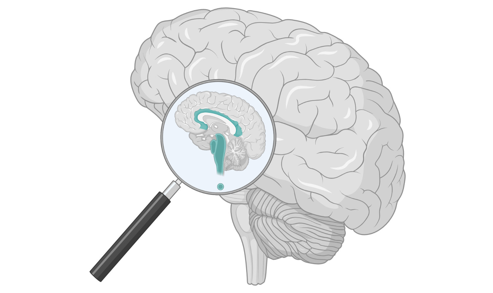

*During the process of writing up my PhD thesis on the topic **"Quality of real-time fMRI: novel software, sequences and signals"** I've had to describe its background and the reasons motivating its focus areas. What follows is my attempt at making this more generally accessible, essentially exploring the question "why and how should we improve the quality of real-time fMRI?"*

---

Humans want to read minds - that is no secret. We have been obsessed with the possibility of mind reading, and of understanding consciousness, since times untold. It is written in our legends, in our cultural history, we sing about it, philosophers muse about it, scientists study it, we write dystopian novels about it, we even attempt it (inadvertently or purposefully?) in our daily lives. I wonder why he is frowning at me, he must think I did something wrong… She must be so frustrated after what happened, I wish I could understand what she's going through… They did what?? What were they thinking? Or to move from the mundane to the purpose-driven: if we could completely understand the human mind, its building blocks, and the intricacies of how they fit together to yield a functioning, awe-inspiring mechanism, imagine what we could achieve with that knowledge. Would we be able to measure consciousness or its levels of function empirically? Would we be able to quantify how a functioning mind differs from one with so-called dysfunction? Could we unpack that systematically, to see which levers we can pull to set a course of corrective action, if so desired? Could we make inroads into addressing some of the most challenging mental conditions of our time, such as depression, Alzheimer's disease, developmental disorders, schizophrenia and many more that are affecting the lives and livelihoods of too many?

As it stands, we do not have to do too much imagining. For just as long as we have been obsessed with mind reading and consciousness, we have also developed theories, conducted experiments, and created technologies to generate and test viable answers. From ancient spiritualism to Descarte, from behaviourism to neurons, from dissecting the nervous system of a frog to the magnetic resonance imaging of a human brain, we have steadily and very concretely added to the body of knowledge of the mind. During the past century this has culminated in the exponential growth of technology-assisted discoveries and inventions that are now synonymous with neuroscience. What was thought of as dystopian a century ago, is common practice today, and will be seen as outdated and even naive a few decades from now. Such is the nature of what we call scientific progress. And the technologies, methods and practices that we develop are paving the way.

But what of the unintended consequences? Are the technologies we build and the methods we develop particularly appropriate to answer such fundamental, sometimes ill-posed, questions? How sure are we that we aren't fooling ourselves, that the elusive object of our study is not in fact playing tricks on, well, itself? And in our rush to improve our models, to build better measurement systems, to make more accurate inferences, and to answer deeper questions, what are we prioritizing? Could we be choosing competition over democratization of ideas, novelty over robustness, quantity over quality, and rationalized conclusions over embracing the complexity of the unknown? As scientists we walk this tightrope every day, balancing our dreams to uncover the unknown with the possibility and responsibility of improving the lives of those whose minds prevent it. So what suffices as our balancing pole?

Transparency in science has this potential. By opening up our data, our methods, and our practices, we allow diverse ideas to enter the pool of knowledge generation. And by sharing these ideas openly, we allow others to error-check our work, to reuse it, and to extend it. Scientists should be no strangers to this iterative process, yet we cannot be complacent in driving it forward to its full potential. If we sincerely want to answer some of life's most profound questions with the high quality, rigourous, robust, and reproducible effort that it requires, we cannot shy away from holding up the magnifying glass to our own work, to our own practices, and to the technologies whose praises we sing.

My work and collaborations over the past 4 years document a single thread along this global tapestry of scientific inquiry: of dreams, to ideation, to technology, to structured and constructive doubt, and ultimately to building shared knowledge on which to iterate. It starts with the question of reading the mind, particularly: how can we explore the human brain in order to understand and treat it? One advanced technology that has allowed us a glimpse into the mind is real-time functional magnetic resonance imaging, where we exploit the magnetic properties of the atoms we consist of by putting them into a large magnet, and watching the scene unfold. Modern day scanners have the ability to image the anatomical properties of our brains at submillimeter accuracy, as well as record brain activity over time as we conduct mental tasks or lie eerily still in the scanner. While anatomical images are ideal for identifying tumours, blood clots and other visible anomalies, functional brain images tell us all about how we process information, how brain regions specialize for certain tasks, and how our brain forms a dynamic functional network. The real-time aspect allows us to do all of this while a person is lying in the scanner, essentially providing a direct window into the mind as we think, feel, process and decide. It has inspired scientists to design novel methods for studying and treating the human brain. Adaptive experiments, for example, are designed to dynamically update the stimuli or tasks presented to the person in the scanner based on their changing brain activity, allowing the study environment to adapt to our mental processes. Another is neurofeedback, where people can learn to self-regulate their brain function by receiving visual feedback of their brain activity at that very moment. The act of self-regulation may lead to changes in mental or physical behaviours, and has been studied as a treatment option in neurological and psychiatric conditions.

So what, one might wonder, are the drawbacks of real-time functional magnetic resonance imaging (or for short, real-time fMRI)? Since it allows us to peer into the human mind, can we say that we have the tools to understand it? Can we now break it down into its building blocks and start rebuilding the minds that require care? As with many advanced technologies, the inner workings of real-time fMRI rest on many levels of intricate details, each with its own complexities. From the physical properties of atoms, to the micro- and macroscopic movement of oxygen and blood through the brain, to the magnetic properties of the scanner, and the eventual context within which the technology is applied: the devil could be hiding anywhere. A useful example is the underlying assumptions of fMRI, which measures brain activity through the proxy of oxygen concentration in blood vessels in the brain. It is known that physiological factors like respiration, heart rate and blood flow, and not only neuronal activity, influence the concentration of blood oxygen in the brain. This can bias both our measurement and our interpretation of said measurement. Are we perhaps adapting the experimental stimuli, or providing neurofeedback, purely based on a higher breathing rate of the person in the scanner, and not based on their changing brain activity? Or could the person's head be moving slightly each time they receive an updated instruction, which is known to lead to synchronised fluctuations in brain image intensity, that we then misinterpret as brain activity? Importantly, are we acquiring enough data and using state-of-the-art methods to ascertain that these confounding factors are indeed accounted for? Or, by not accounting for these drawbacks, are we drawing incorrect conclusions from our experiments that could ultimately lead to the technology being considered beneficial to patients when in fact it is not? Or the reverse?

Thus, what of the quality of our technology, our measurements, our methods, and of our inferences? What should we be investigating as possible confounding factors when measuring and interpreting brain activity? Can we quantify these, ideally in real-time, in order to capture and discard bad quality data as they are acquired? Can we develop new MRI sequences that already provide an improved quality fMRI signal upon acquisition, with higher sensitivity to brain activity changes? And could we improve our existing real-time signal processing methods, and develop novel ones, so as to extract an increasingly truer version of brain activity? By posing these questions, and developing robust methods and experiments to answer them, we approach our work through a necessary critical lense, systematically breaking down the ultimate challenge of understanding the human mind into smaller, manageable pieces.

What follows - having identified the dream, the technology, and the structured approach to self-critical inquiry and improvement - is to prioritise transparency. If we develop new signal processing methods for improving the quality of measured brain activity in real-time, can we describe them in such a way that others can understand, reuse and improve on them? And can we openly share the software implementation of said methods, providing an inclusive platform for all to learn from and contribute to? If we collect a novel dataset using a newly developed sequence, can we make this dataset available to the fMRI community for future research while simultaneously prioritising the personal data privacy of study participants?

By making each quantifiable step of our research as transparent and accessible as is practically and ethically possible, we take part in the global process of iterative progress. If our ultimate goal is to understand the human mind and to use our understanding for the betterment of humankind, all of humankind should be able to weigh in, and all of humankind should be able to contribute to and benefit from the outcomes.